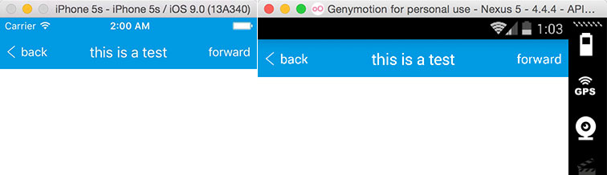

# react-native-navigation-bar


NavigationBar written in pure javascript for cross-platform support

Since most of our apps have a similar navigationBar, we made it to be a common component

Needs react-native >= 0.14.2



###Documentation
```
	title: PropTypes.string.isRequired,
	//not include the height of statusBar on ios platform
	height: PropTypes.number,
	titleColor: PropTypes.string,
	backgroundColor: PropTypes.string,
	leftButtonTitle: PropTypes.string,
	leftButtonTitleColor: PropTypes.string,
	onLeftButtonPress: PropTypes.func,
	rightButtonTitle: PropTypes.string,
	rightButtonTitleColor: PropTypes.string,
	onRightButtonPress: PropTypes.func
```

###Usage

####Step 1 - install

```
	npm install react-native-navigation-bar --save
```

####Step 2 - import and use in project
```javascript
	import NavigationBar from 'react-native-navigation-bar';

	<NavigationBar 
		title={'this is a test'}
		height={44}
		titleColor={'#fff'}
		backgroundColor={'#149be0'}
		leftButtonIcon={}
		leftButtonTitle={'back'}
		leftButtonTitleColor={'#fff'}
		onLeftButtonPress={onBackHandle} 
		rightButtonIcon={}
		rightButtonTitle={'forward'}
		rightButtonTitleColor={'#fff'}
		onRightButtonPress={onForwardHandle}
	/>
```

